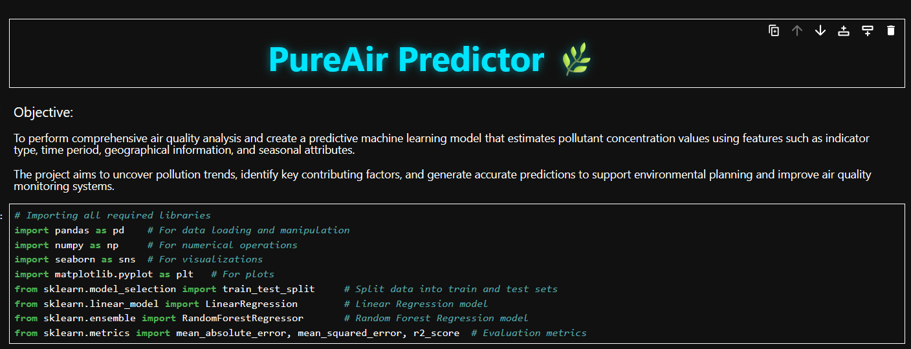
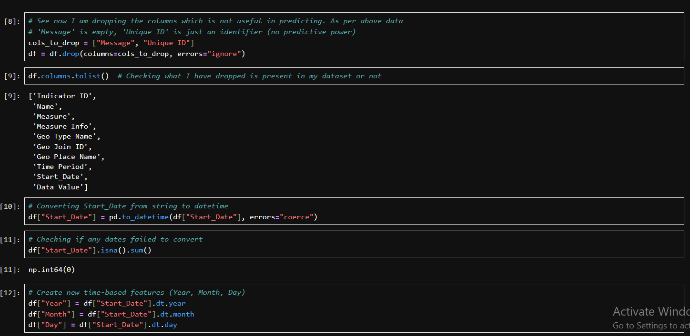
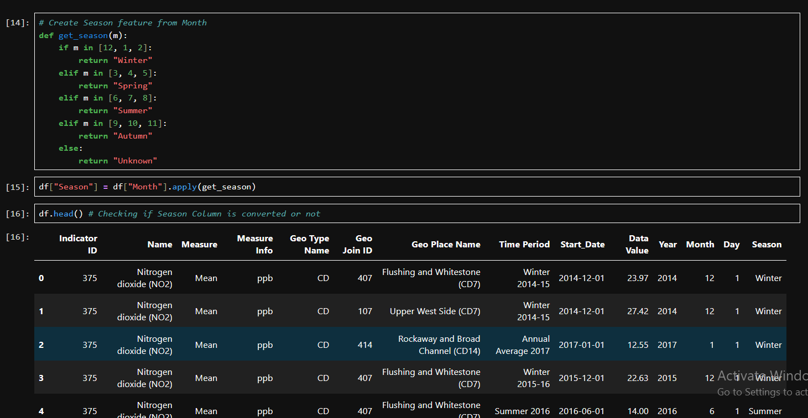
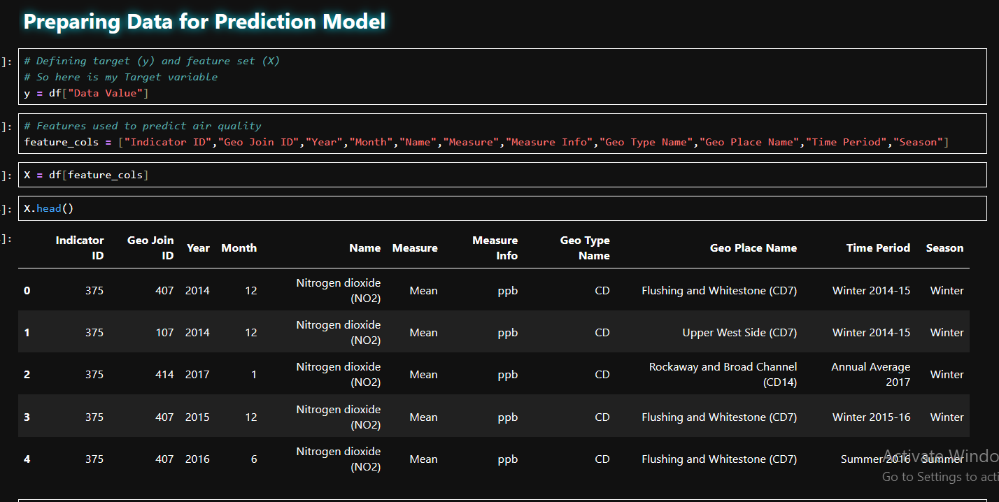
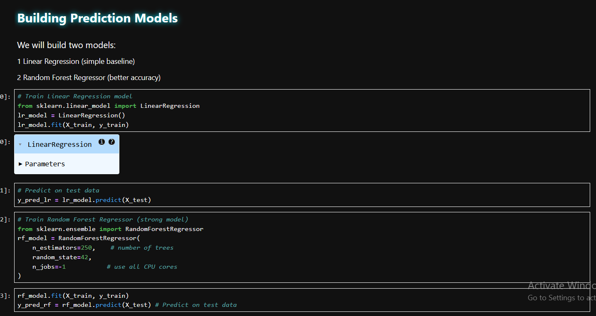
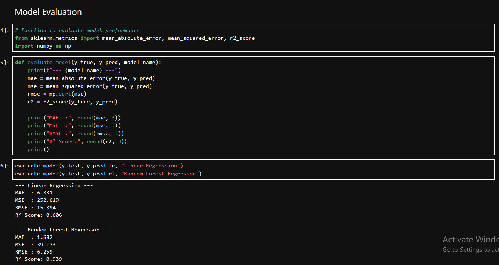
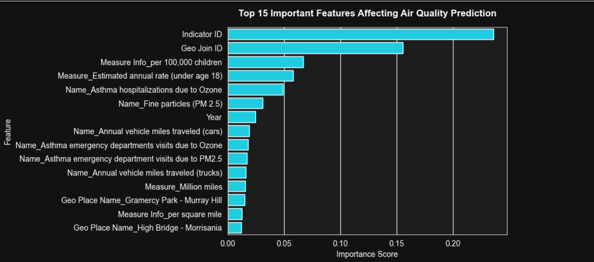

<h1 align="center">
🌍 PureAir Air Quality Prediction
</h1>

<p align="center">
An end-to-end <b>Machine Learning</b> project that predicts <b>Air Quality</b> using historical environmental data. The project combines <b>Exploratory Data Analysis (EDA)</b>, <b>Feature Engineering</b>, <b>Linear Regression</b>, <b>Random Forest Regressor</b>, and <b>Model Evaluation</b> to generate accurate air quality predictions.
</p>

<p align="center">


</p>

<p align="center">

</p>

<p align="center">
<i>Predict • Analyze • Evaluate • Improve Air Quality using Machine Learning</i>
</p>

# 📂 Dataset Information

The project uses a historical Air Quality dataset containing environmental pollution measurements collected across multiple locations and time periods.

### Dataset Summary

| Attribute | Details |
|-----------|----------|
| Dataset | Air Quality Dataset |
| Records | 18,862+ |
| Features | 12 |
| Target Variable | Data Value |
| Domain | Environmental Monitoring |
| Problem Type | Regression |

---

# 📊 Dataset Overview

The project uses a historical **Air Quality Dataset** collected from the **Data.gov**. The dataset contains environmental pollution measurements recorded across different locations and time periods and is used to predict air quality values through regression models.

### Dataset Summary

| Attribute | Details |
|-----------|----------|
| 📁 Dataset | Air Quality Dataset |
| 🌐 Source | Data.gov |
| 📊 Records | 18,862 |
| 📋 Features | 12 |
| 🎯 Target Variable | Data Value |
| 🤖 Problem Type | Regression |

### Dataset Features

- Indicator ID
- Indicator Name
- Measure
- Measure Information
- Geo Type Name
- Geo Join ID
- Geo Place Name
- Time Period
- Start Date
- Data Value *(Target Variable)*

The dataset combines **geographical**, **temporal**, and **environmental** attributes, enabling the Machine Learning models to learn pollution patterns and predict air quality effectively.

---

# 🧹 Data Preprocessing

Raw environmental datasets usually contain unnecessary columns and require transformation before they can be used for Machine Learning.

The following preprocessing steps were performed:

- Removed unnecessary columns (`Message`, `Unique ID`)
- Converted `Start_Date` into datetime format
- Checked for invalid date values
- Prepared clean data for feature engineering
- Organized data for predictive modeling

<p align="center">

</p>

---

# ⚙️ Feature Engineering

To improve the predictive capability of the model, several new features were extracted from the date column.

New features created:

- Year
- Month
- Day
- Season

These temporal features help the model capture seasonal pollution patterns and long-term environmental trends.

<p align="center">

</p>

### Why Feature Engineering?

Feature Engineering enables Machine Learning models to learn hidden relationships that are not directly available in the raw dataset.

For example:

- Winter generally experiences different pollution levels than Summer.
- Pollution trends vary across months.
- Year-wise trends help identify long-term environmental changes.

---

# 🎯 Feature Selection

The target variable selected for prediction was:

```python
Data Value
```

The following features were used for training:

- Indicator ID
- Geo Join ID
- Name
- Measure
- Measure Info
- Geo Type Name
- Geo Place Name
- Time Period
- Year
- Month
- Season

<p align="center">

</p>

These selected features provide geographical, temporal, and environmental context that improves prediction accuracy.

---

# ✂️ Train-Test Split

Before training the Machine Learning models, the dataset was divided into training and testing subsets.

- Training Data → Used for learning patterns
- Testing Data → Used for evaluating model performance

This ensures that the model is evaluated on unseen data and helps measure its generalization capability.

---

---

# 📖 Project Overview

Air pollution is one of the major environmental challenges affecting human health and urban sustainability. Accurate prediction of air quality enables governments, environmental agencies, and researchers to make informed decisions for pollution control and public health planning.

This project presents an **end-to-end Machine Learning pipeline** developed to predict air quality using historical environmental data. The workflow includes **data preprocessing, exploratory data analysis (EDA), feature engineering, model training, model evaluation, and feature importance analysis**.

Two regression algorithms were implemented:

- Linear Regression (Baseline Model)
- Random Forest Regressor (Final Model)

The models were evaluated using **MAE, MSE, RMSE, and R² Score**, where **Random Forest Regressor** achieved the highest predictive performance.

---

# 🎯 Objectives

- Analyze historical air quality data.
- Perform Exploratory Data Analysis (EDA).
- Clean and preprocess the dataset.
- Engineer meaningful features for prediction.
- Train multiple regression models.
- Compare model performance.
- Predict pollutant concentration values.
- Identify the most influential features affecting air quality.
- Demonstrate an end-to-end Machine Learning workflow.

---

# 🛠 Tech Stack

| Category | Technology |
|-----------|------------|
| Programming Language | Python |
| Data Analysis | Pandas, NumPy |
| Data Visualization | Matplotlib, Seaborn |
| Machine Learning | Scikit-learn |
| Models | Linear Regression, Random Forest Regressor |
| Notebook | Jupyter Notebook |

---

# 🔄 Machine Learning Workflow

```text
Historical Air Quality Dataset
            │
            ▼
   Exploratory Data Analysis
            │
            ▼
     Data Preprocessing
            │
            ▼
    Feature Engineering
            │
            ▼
     Feature Selection
            │
            ▼
      Train-Test Split
            │
     ┌───────────────┐
     ▼               ▼
Linear Regression  Random Forest
     │               │
     └──────┬────────┘
            ▼
     Model Evaluation
            │
            ▼
   Feature Importance
            │
            ▼
 Final Air Quality Prediction
```

---

# 📊 Project Highlights

- ✅ End-to-End Machine Learning Project
- ✅ Exploratory Data Analysis (EDA)
- ✅ Feature Engineering
- ✅ Data Preprocessing
- ✅ Linear Regression
- ✅ Random Forest Regressor
- ✅ Model Comparison
- ✅ Performance Evaluation
- ✅ Feature Importance Analysis
- ✅ Air Quality Prediction

---

# 🤖 Model Development

To predict air quality values, two supervised Machine Learning regression models were implemented and compared.

## Model 1 — Linear Regression

Linear Regression was selected as the baseline model to establish a simple relationship between the input features and the target variable.

**Advantages**
- Simple and easy to interpret
- Fast training
- Good baseline model

**Limitations**
- Assumes a linear relationship
- Sensitive to outliers
- Cannot effectively capture complex non-linear patterns

---

## Model 2 — Random Forest Regressor

Random Forest Regressor was implemented to improve prediction accuracy by combining multiple Decision Trees.

Key Parameters:

- Number of Trees (`n_estimators`) = **250**
- Random State = **42**
- Parallel Processing (`n_jobs = -1`)

**Advantages**

- Captures complex non-linear relationships
- Handles categorical and numerical features effectively
- Less prone to overfitting
- High prediction accuracy
- Robust against noisy data

<p align="center">

</p>

---

# 📈 Model Evaluation

The trained models were evaluated using standard regression metrics.

### Evaluation Metrics

| Metric | Description |
|---------|-------------|
| MAE | Mean Absolute Error |
| MSE | Mean Squared Error |
| RMSE | Root Mean Squared Error |
| R² Score | Goodness of Fit |

<p align="center">

</p>

---

# 📊 Model Performance Comparison

| Model | MAE ↓ | MSE ↓ | RMSE ↓ | R² Score ↑ |
|--------|------:|-------:|--------:|-----------:|
| Linear Regression | **6.831** | **252.619** | **15.894** | **0.606** |
| Random Forest Regressor | **1.682** | **39.173** | **6.259** | **0.939** |

---

# 🏆 Best Performing Model

The **Random Forest Regressor** achieved the best overall performance across all evaluation metrics.

### Why Random Forest Performed Better?

- Learned complex relationships within the dataset.
- Captured seasonal and geographical patterns effectively.
- Reduced prediction error significantly.
- Achieved a much higher R² Score.
- Produced more reliable predictions than Linear Regression.

---

# 📉 Feature Importance Analysis

One of the major advantages of Random Forest is its ability to identify the importance of each feature used during training.

<p align="center">

</p>

### Top Important Features

- Indicator ID
- Geo Join ID
- Measure Information
- Indicator Name
- Year

These features contributed the most toward predicting air quality values.

---

# 🎯 Prediction Summary

The developed Machine Learning pipeline successfully predicts air quality measurements using historical environmental data.

The model is capable of learning complex environmental relationships and can support pollution monitoring, environmental planning, and data-driven decision-making.

---

# 💡 Key Learnings

Through this project, I gained practical experience in:

- Exploratory Data Analysis (EDA)
- Data Cleaning
- Feature Engineering
- Feature Selection
- Regression Algorithms
- Model Evaluation
- Feature Importance Analysis
- End-to-End Machine Learning Workflow

---

# 📁 Repository Structure

```text
PureAir-Air-Quality-Prediction
│
├── Air_Quality.csv
├── PureAir Predictor.ipynb
├── README.md
│
└── Images
    ├── banner.png
    ├── dataset_preview.png
    ├── data_preprocessing.png
    ├── feature_engineering.png
    ├── feature_selection.png
    ├── model_training.png
    ├── model_evaluation.png
    └── feature_importance.png
```

---

# 🚀 How to Run the Project

## 1️⃣ Clone the Repository

```bash
git clone https://github.com/VikashSingh81/PureAir-Air-Quality-Prediction.git
```

---

## 2️⃣ Navigate to the Project Folder

```bash
cd PureAir-Air-Quality-Prediction
```

---

## 3️⃣ Install Required Libraries

```bash
pip install pandas numpy matplotlib seaborn scikit-learn jupyter
```

---

## 4️⃣ Launch Jupyter Notebook

```bash
jupyter notebook
```

Open:

```
PureAir Predictor.ipynb
```

Run all the notebook cells sequentially to reproduce the complete Machine Learning workflow.

---

# 📦 Project Workflow

The complete workflow followed in this project is illustrated below.

```
Dataset
   │
   ▼
Data Cleaning
   │
   ▼
Feature Engineering
   │
   ▼
Feature Selection
   │
   ▼
Train-Test Split
   │
   ▼
Linear Regression
        &
Random Forest
   │
   ▼
Model Evaluation
   │
   ▼
Feature Importance
   │
   ▼
Prediction
```

---

# 🎯 Project Outcomes

✔ Successfully analyzed historical air quality data.

✔ Built an end-to-end Machine Learning pipeline.

✔ Engineered meaningful temporal features.

✔ Compared multiple regression algorithms.

✔ Achieved excellent prediction accuracy using Random Forest.

✔ Identified the most influential factors affecting air quality.

✔ Developed a reusable workflow for predictive environmental analytics.

---

# 🌍 Real-World Applications

The developed prediction system can be applied in:

- Smart City Monitoring
- Environmental Research
- Pollution Forecasting
- Government Air Quality Monitoring
- Public Health Analytics
- Climate Change Studies
- Urban Planning
- Sustainability Research

---

# 📈 Future Improvements

The project can be further enhanced by:

- Deploying the model using Streamlit or Flask.
- Integrating live Air Quality API data.
- Experimenting with XGBoost and LightGBM.
- Hyperparameter tuning using GridSearchCV.
- Implementing Cross Validation.
- Building a real-time prediction dashboard.
- Deploying the project on Render or Hugging Face Spaces.

---

# 💼 Resume Highlights

This project demonstrates practical experience in:

- Machine Learning
- Exploratory Data Analysis
- Data Cleaning
- Feature Engineering
- Regression Modeling
- Model Evaluation
- Feature Importance Analysis
- Predictive Analytics
- Python Data Science Ecosystem

---

# ⭐ Why This Project Stands Out

Unlike a simple Machine Learning notebook, this project demonstrates the complete lifecycle of an ML solution—from understanding the dataset and engineering meaningful features to training, evaluating, and comparing multiple models. The workflow emphasizes practical problem-solving and data-driven decision-making, making it representative of real-world Machine Learning projects.

# 📁 Repository Structure

```text
PureAir-Air-Quality-Prediction
│
├── Air_Quality.csv
├── PureAir Predictor.ipynb
├── README.md
│
└── Images
    ├── banner.png
    ├── dataset_preview.png
    ├── data_preprocessing.png
    ├── feature_engineering.png
    ├── feature_selection.png
    ├── model_training.png
    ├── model_evaluation.png
    └── feature_importance.png
```

---

# 🚀 How to Run the Project

## 1️⃣ Clone the Repository

```bash
git clone https://github.com/VikashSingh81/PureAir-Air-Quality-Prediction.git
```

---

## 2️⃣ Navigate to the Project Folder

```bash
cd PureAir-Air-Quality-Prediction
```

---

## 3️⃣ Install Required Libraries

```bash
pip install pandas numpy matplotlib seaborn scikit-learn jupyter
```

---

## 4️⃣ Launch Jupyter Notebook

```bash
jupyter notebook
```

Open:

```
PureAir Predictor.ipynb
```

Run all the notebook cells sequentially to reproduce the complete Machine Learning workflow.

---

# 📦 Project Workflow

The complete workflow followed in this project is illustrated below.

```
Dataset
   │
   ▼
Data Cleaning
   │
   ▼
Feature Engineering
   │
   ▼
Feature Selection
   │
   ▼
Train-Test Split
   │
   ▼
Linear Regression
        &
Random Forest
   │
   ▼
Model Evaluation
   │
   ▼
Feature Importance
   │
   ▼
Prediction
```

---

# 🎯 Project Outcomes

✔ Successfully analyzed historical air quality data.

✔ Built an end-to-end Machine Learning pipeline.

✔ Engineered meaningful temporal features.

✔ Compared multiple regression algorithms.

✔ Achieved excellent prediction accuracy using Random Forest.

✔ Identified the most influential factors affecting air quality.

✔ Developed a reusable workflow for predictive environmental analytics.

---

# 🌍 Real-World Applications

The developed prediction system can be applied in:

- Smart City Monitoring
- Environmental Research
- Pollution Forecasting
- Government Air Quality Monitoring
- Public Health Analytics
- Climate Change Studies
- Urban Planning
- Sustainability Research

---

# 📈 Future Improvements

The project can be further enhanced by:

- Deploying the model using Streamlit or Flask.
- Integrating live Air Quality API data.
- Experimenting with XGBoost and LightGBM.
- Hyperparameter tuning using GridSearchCV.
- Implementing Cross Validation.
- Building a real-time prediction dashboard.
- Deploying the project on Render or Hugging Face Spaces.

---

# 💼 Resume Highlights

This project demonstrates practical experience in:

- Machine Learning
- Exploratory Data Analysis
- Data Cleaning
- Feature Engineering
- Regression Modeling
- Model Evaluation
- Feature Importance Analysis
- Predictive Analytics
- Python Data Science Ecosystem

---

# ⭐ Why This Project Stands Out

Unlike a simple Machine Learning notebook, this project demonstrates the complete lifecycle of an ML solution—from understanding the dataset and engineering meaningful features to training, evaluating, and comparing multiple models. The workflow emphasizes practical problem-solving and data-driven decision-making, making it representative of real-world Machine Learning projects.

---

# 👨‍💻 Author

## Vikash Kumar Singh

**B.Tech Computer Science & Engineering**

📊 Aspiring **Data Analyst**, **Data Scientist**, **Machine Learning Engineer**, and **Software Engineer** passionate about solving real-world problems through Data Analytics, Machine Learning, and Artificial Intelligence.

---

# 📬 Connect With Me

<p align="center">

<a href="https://github.com/VikashSingh81">

</a>

<a href="https://www.linkedin.com/in/vikashsingh89/">

</a>

</p>

---

# 📚 References

- NYC Open Data – Air Quality Dataset
- Scikit-learn Documentation
- Pandas Documentation
- NumPy Documentation
- Matplotlib Documentation
- Seaborn Documentation

---

# 📄 License

This repository is created for educational, learning, and portfolio purposes.

Feel free to explore the project and use it as a reference for learning Machine Learning workflows.

---

# ⭐ Support

If you found this project useful:

- ⭐ Star this repository
- 🍴 Fork the repository
- 💬 Share your feedback
- 🤝 Connect with me on LinkedIn

---

# 🎯 Interview Highlights

This project demonstrates practical understanding of:

✔ End-to-End Machine Learning Pipeline

✔ Exploratory Data Analysis (EDA)

✔ Data Cleaning & Preprocessing

✔ Feature Engineering

✔ Feature Selection

✔ Regression Algorithms

✔ Random Forest Regressor

✔ Linear Regression

✔ Model Evaluation

✔ Feature Importance

✔ Predictive Analytics

✔ Python Data Science Libraries

---

# 🚀 Placement Ready Skills

Through this project, I strengthened my understanding of:

- Machine Learning Fundamentals
- Data Analysis
- Feature Engineering
- Model Evaluation
- Performance Metrics
- Problem Solving
- Predictive Modeling
- Environmental Data Analysis
- Business-Oriented Data Interpretation

---

# 📌 Key Takeaways

This project showcases an end-to-end Machine Learning workflow starting from raw environmental data to generating accurate air quality predictions.

It demonstrates practical implementation of data preprocessing, feature engineering, model development, evaluation, and interpretation using Python and Scikit-learn.

The project reflects my ability to solve real-world analytical problems using Machine Learning techniques and data-driven decision-making.

---

<h3 align="center">
⭐ Thank You for Visiting ⭐
</h3>
